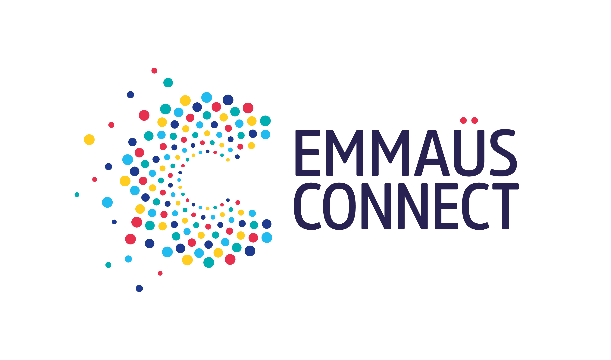

# :star: SolidariTech :star:

Hackathon réalisé en partenariat avec

Projet réalisé en 2 jours en équipe de 5 personnes puis présenté devant un jury composé d'un membre d'Emmaüs Connect et de formateurs data de l'école.

Ce projet nous a hissé jusqu'à la finale de ce Hackathon.

##
## Sujet :
A partir d'un sondage réalisé tous les ans par l'ARCEP depuis 2007 sur un échantillon de personnes représentatif de la population française,

notre mission était de produire une analyse sur les usages les moins effectués par certaines catégories de population, afin
d’orienter Emmaüs Connect sur les besoins de ces catégories pour pouvoir les aider et les former.

##
## Réponse et outils utilisés :
Nous y avons répondu en proposant différentes **visualisations** de la base de données.  
Nous avons ensuite généré un outil permettant à Emmaüs Connect de trouver ses propres personas type à former, ceci via 2 onglets : 

* le premier en entrant un usage précis, cela retournant selon 6 critères (Âge, Genre, CSP, Plus haut diplôme, Type d'Agglomération habitée, Région) la catégorie de population réalisant le moins cet usage,
* le second en modifiant des filtres correspondant à ces mêmes critères, cela ressortant les besoins en terme d'usages.

Cet outil a été produit avec **Python** et **Streamlit**, la présentation a été réalisée via le logiciel **Canva** et les graphiques qu'elle intègre ont été réalisés avec les logiciels **Power BI** et **Tableau**.

##
## Les éléments importants :
* [La présentation CANVA convertie au format PDF](https://github.com/Datalex0/SolidariTech/blob/960dc6ade9bf34b8e82d375a683065ddaabadd15/SRC/Pr%C3%A9sentation%20CANVA.pdf)
* Le code (en python)
* Les fichiers CSV
* [Le lien vers la démonstration Streamlit](https://solidaritech.streamlit.app/)

